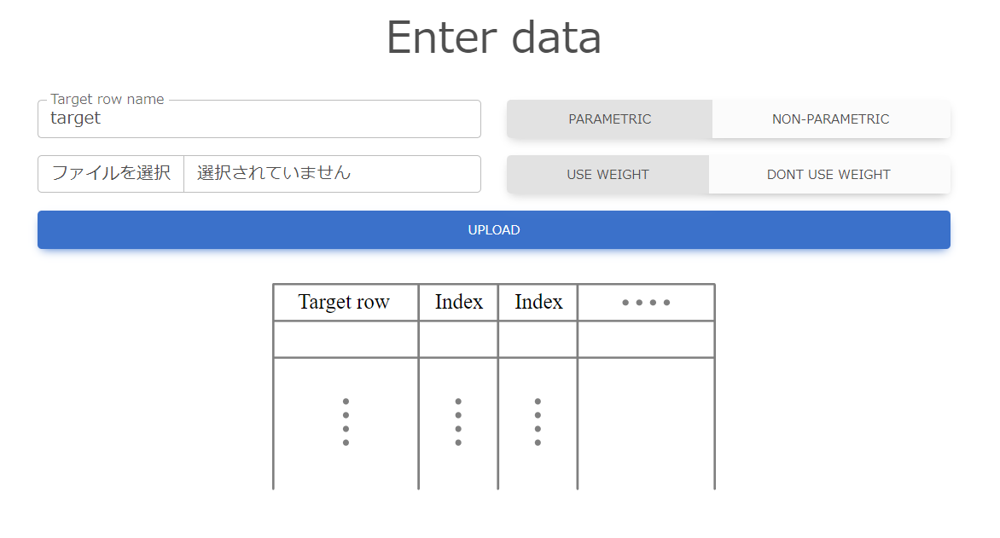
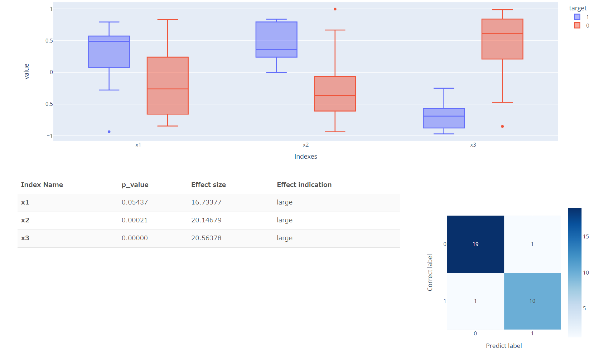

# Statistics_Application
- Statistics application using Flask  
- This is a test and classification application using Flask. Nonparametric and parametric tests are supported, and logistic regression is used for classification.  
- In the nonparametric case, the Brunner-Munzel test and Cliff's Delta are used, while the Student's t-test and Cohen's d are used in the parametric case.  
- When the number of samples to be classified is less than 50, Leave One Out is used, and when the number is greater than 50, 4-HOLD cross-validation is used to verify generalization performance.  
**Support multi-class classification**  
  
（Flaskを用いた統計アプリケーションです．  
Non-parametric検定とParametric検定に対応しており，ロジステック回帰を使用することで分類精度の確認が可能です．  
今回は，以前作成したものを多クラス分類に対応させて公開しております．）  

## Input form image

## Example of output

  
# Reference
## Target row name
Column Name of Objective Variable  
## Input file
CSV file to be input to the statistics application. indexes, etc. should be deleted beforehand.
## Parametric or Non-parametric
The type of statistics can be changed: Non-parametric uses the Brunner-Munzel test and Cliff's delta; Parametric uses the Student's t-test and Cohen's d.
## Use weight or Dont use weight
When performing logistic regression, you can change whether or not weights are assigned to each class. Usually, weights are assigned when the classes are unbalanced, and not otherwise.  
# Getting start

1. Install Python library
~~~ python
pip install flask
pip install pandas
pip install scipy
pip install plotly
pip install scikit-learn
~~~

2. Execute main.py
~~~ python
python main.py
~~~

3. Access Local Page
For example
127.0.0.1:5000

4. Submit your csv file

**Have to need target row (target variable 0 and 1) in csv file**

5. Press UPLOAD button

## License

GNU General Public License version 2.0

## Special Thanks

Using Cliff's Delta library. Rep url is https://github.com/neilernst/cliffsDelta

Made this program with shino-shino
